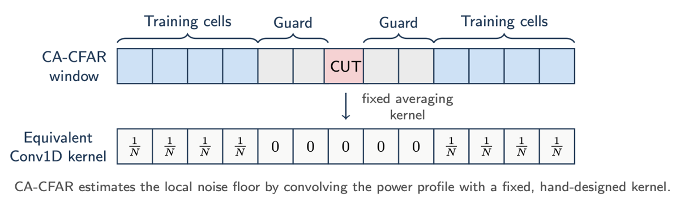
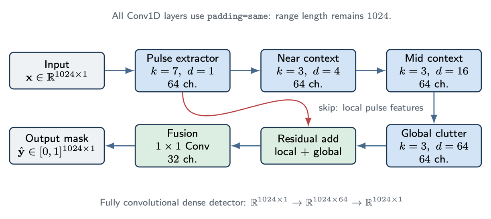
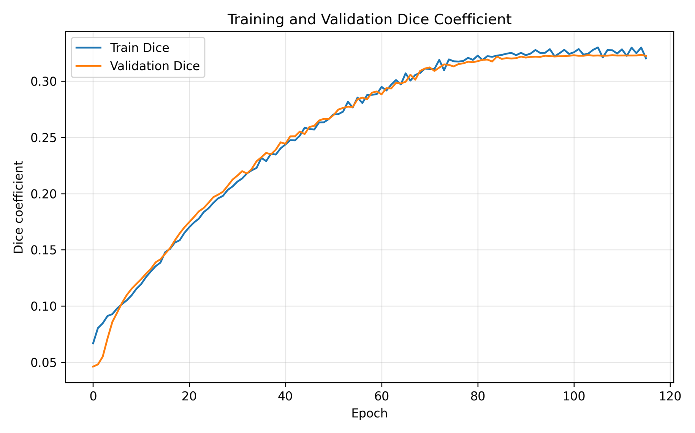
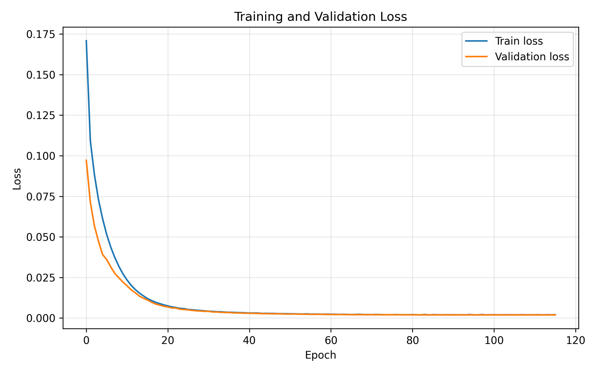
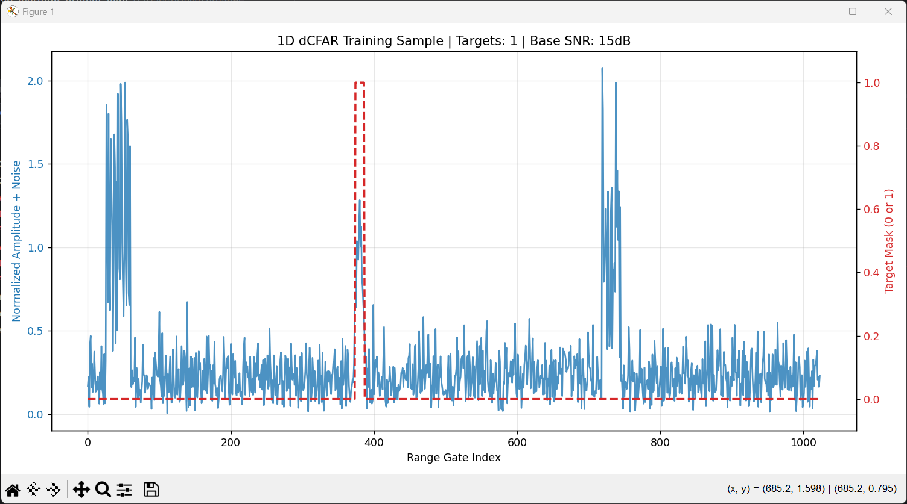

# 1. Introduction

Radar detection is the first decision stage in a radar processing chain. A radar transmits electromagnetic energy, receives echoes reflected from objects, processes the returned signal, and decides which range cells contain physical targets rather than thermal noise, clutter, or processing artifacts. This decision is critical because every later stage depends on it: missed detections reduce target observability, while false alarms overload the tracking and data association system.

The classical engineering solution for this problem is **Constant False Alarm Rate** detection, usually abbreviated as **CFAR**. CFAR algorithms estimate the local background level around each **Cell Under Test** and compare the tested cell to an adaptive threshold. In homogeneous noise or homogeneous clutter, this approach is highly effective because the neighboring cells are statistically representative of the tested cell.

The central limitation appears when the environment is heterogeneous. Near a clutter edge, the CFAR training window may include high-power clutter on one side and clean noise on the other. The averaged background estimate becomes contaminated by the clutter block, the threshold rises, and a physical target near the clutter boundary can be suppressed. This phenomenon is known as **target masking**.

This project investigates a focused hypothesis:

> Classical CA-CFAR can be interpreted as a fixed convolutional detector whose parameters are manually selected from radar theory. A trainable 1D convolutional neural network may learn a more effective adaptive detection function for heterogeneous clutter environments where the fixed CFAR assumptions are violated.

The goal is not to claim that deep learning should replace CFAR in general. CFAR remains computationally efficient, analytically interpretable, and provides direct control over the false alarm probability. The goal is narrower: to demonstrate a proof of concept that, in a specific high-clutter and high-noise detection regime, a dedicated deep learning model can outperform a classical fixed-parameter detector.

The proposed system, **AdaCFAR-1D**, operates on one-dimensional non-coherently integrated radar range profiles. It formulates radar detection as a dense binary segmentation problem over range gates. For each input profile, the network outputs a probability mask indicating which range bins belong to target returns.

The project contains three main components: a physics-inspired radar simulator used to generate synthetic training data, a classical CA-CFAR baseline used as the engineering reference, and a trainable dilated Conv1D detector designed to learn both local target shape and long-range clutter context.

# 2. CFAR as a Fixed Convolution

## 2.1 Radar Detection Background

A radar target return is governed by the radar range equation:

$$P_r = \frac{P_t G_t G_r \lambda^2 \sigma}{(4\pi)^3 R^4}$$

where $P_r$ is the received power, $P_t$ is the transmitted power, $G_t$ and $G_r$ are the transmit and receive antenna gains, $\lambda$ is the wavelength, $\sigma$ is the radar cross section, and $R$ is the target range.

The $R^4$ term is the dominant physical scaling. The transmitted wave spreads over a sphere on the way to the target, and the reflected wave spreads again on the way back. As a result, received target power decreases rapidly with range. A detector trained on radar-like data should therefore not see target amplitudes as arbitrary mathematical peaks. It should see signals generated from a physically meaningful propagation model.

The signal-to-noise ratio is

$$\mathrm{SNR} = \frac{P_r}{P_n}$$

where $P_n$ is the noise power. In thermal-noise-limited radar receivers, the noise power is commonly modeled as $P_n = kTBF$, where $k$ is Boltzmann's constant, $T$ is the system temperature, $B$ is the receiver bandwidth, and $F$ is the receiver noise factor.

A pulsed radar transmits a pulse and samples the received echo over fast time. A received echo from range $R$ appears after the two-way delay

$$\tau_R = \frac{2R}{c}$$

where $c$ is the speed of light. With sampling frequency $f_s$, one range sample corresponds to $\Delta R = c/(2f_s)$. In this project, the main simulated submode uses $f_s=10\,\mathrm{MHz}$, pulse width $1\,\mu\mathrm{s}$, $1024$ range gates, $256$ pulses, and PRF $2000\,\mathrm{Hz}$. This gives a sample spacing of approximately $14.99\,\mathrm{m}$ and a represented range extent of approximately $15.35\,\mathrm{km}$.

The radar signal is processed into a one-dimensional range profile by beamforming, pulse compression, envelope detection, and non-coherent integration. AdaCFAR-1D operates only on this final range profile.

## 2.2 CA-CFAR Detection Rule

Cell-Averaging CFAR estimates the local background power around a Cell Under Test while excluding guard cells around the tested bin. Let $x_i$ denote the magnitude profile and let $p_i=x_i^2$ be the square-law detected power. For a CUT at index $i$, CA-CFAR estimates the local noise floor as

$$\hat{P}_{n,i} = \frac{1}{N}\sum_{k \in \mathcal{T}_i} p_k$$

where $\mathcal{T}_i$ is the set of training cells and $N=|\mathcal{T}_i|$. The threshold is

$$T_i = \alpha \hat{P}_{n,i}$$

and a detection is declared when $p_i > T_i$. For CA-CFAR under the standard exponential-noise power model, the scaling factor is

$$\alpha = N\left(P_{FA}^{-1/N}-1\right)$$

The baseline used in this project was a CA-CFAR detector with $12$ training cells per side, $6$ guard cells per side, and $P_{FA}=10^{-4}$.

## 2.3 CFAR as a Hand-Crafted Convolution

The CA-CFAR background estimate can be written as a one-dimensional convolution. For example, if a detector uses four training cells on each side and two guard cells on each side, the averaging kernel has the structure

$$\mathbf{w}_{CFAR} = \frac{1}{N}[1,1,1,1,0,0,0,0,0,1,1,1,1]$$

The zeros correspond to the guard cells and the CUT. The ones correspond to manually selected training cells. The CFAR operation is therefore

$$\hat{P}_{n,i} = (\mathbf{w}_{CFAR} * \mathbf{p})_i$$

followed by the threshold comparison $p_i > \alpha(\mathbf{w}_{CFAR} * \mathbf{p})_i$.

This interpretation provides the conceptual bridge to deep learning. CA-CFAR is already a convolutional detector, but its kernel is fixed by manual design. The number of training cells, number of guard cells, and threshold factor are chosen before deployment. These choices encode assumptions about the local statistics of the environment.

A Conv1D layer performs the same kind of local operation, but its weights are learned from data rather than manually specified. The central idea of this project is therefore not to replace signal processing with an unrelated neural network. The idea is to replace a fixed hand-crafted convolutional detector with a learned convolutional detector specialized for the target environment.

## 2.4 Target Masking

CA-CFAR works when the training cells are statistically representative of the CUT:

$$P(p_k \mid k \in \mathcal{T}_i) \approx P(p_i \mid \text{background})$$

At a clutter edge, this assumption breaks. One side of the window may contain clean noise while the other side contains high-amplitude clutter. The estimate $\hat{P}_{n,i}$ is then biased upward:

$$\hat{P}_{n,i} = \frac{1}{N}\left(\sum_{k \in \mathcal{T}_{clean}} p_k + \sum_{k \in \mathcal{T}_{clutter}} p_k\right)$$

If the clutter contribution dominates, then the threshold $T_i=\alpha\hat{P}_{n,i}$ becomes too high for nearby targets. A true target can satisfy $p_i<T_i$ even when its physical SNR would be sufficient in a homogeneous environment. This is target masking.

The problem is not that convolution is inappropriate. The problem is that the convolution kernel is fixed and cannot adapt to the clutter geometry.

# 3. Radar Simulation and Dataset Generation

## 3.1 Design Philosophy

The dataset was generated synthetically because no real radar data was used. This constraint is important: the project is a proof of concept using a physically motivated simulator, not a validated operational radar detector.

The simulator was designed to avoid training on arbitrary mathematical spikes. Each profile is generated through a radar-inspired signal chain:

1. Complex target signal generation using radar equation amplitude scaling.
2. Antenna array response and beamforming.
3. Digital pulse compression using a rectangular matched filter.
4. Envelope detection.
5. Non-coherent integration across pulses.
6. Synthetic thermal noise and heterogeneous clutter injection.
7. Binary target-mask generation from the processed clean target response.

This matters because the model learns target responses after radar processing rather than idealized target centers.

## 3.2 Target Signal Model

Each target is represented by range, azimuth, elevation, radial velocity, and radar cross section. A target is included only if it lies inside the simulated beam field of view. For a target that passes the field-of-view test, the two-way delay is $\tau_R=2R/c$ and the Doppler frequency is

$$f_D = \frac{2v_r}{\lambda}$$

The target return across pulses is modulated by $e^{j2\pi f_D mT_{PRI}}$, where $m$ is the pulse index and $T_{PRI}$ is the pulse repetition interval. The received amplitude is computed from the radar equation:

$$A_R = \sqrt{\frac{P_tG_tG_r\lambda^2\sigma}{(4\pi)^3R^4}}$$

Multiple targets are added linearly before processing. The raw simulated signal is a complex tensor with shape $16 \times 1024 \times 256$, corresponding to $16$ antenna elements, $1024$ range gates, and $256$ pulses.

## 3.3 Radar Configuration

The primary radar configuration used for the dataset is summarized below.

| Parameter | Value |
|---|---:|
| Carrier frequency | $9.6\,\mathrm{GHz}$ |
| Transmit power | $10\,\mathrm{dB}$ |
| Transmit gain | $30\,\mathrm{dB}$ |
| Receive gain | $30\,\mathrm{dB}$ |
| Array size | $4 \times 4$ |
| Element spacing | $0.0156\,\mathrm{m}$ |
| Azimuth coverage | $[-60^\circ,60^\circ]$ |
| Elevation coverage | $[-10^\circ,10^\circ]$ |

The main operating submode is:

| Parameter | Value |
|---|---:|
| Sampling frequency | $10\,\mathrm{MHz}$ |
| PRF | $2000\,\mathrm{Hz}$ |
| PRI | $0.5\,\mathrm{ms}$ |
| Pulse width | $1\,\mu\mathrm{s}$ |
| Pulses per profile | $256$ |
| Range gates | $1024$ |
| Azimuth beam width | $20^\circ$ |
| Elevation beam width | $6^\circ$ |

The maximum unambiguous Doppler velocity implied by the PRF is

$$v_{max}=\frac{\lambda f_{PRF}}{4}\approx 15.6\,\mathrm{m/s}$$

Targets were sampled with radial velocities inside $80\%$ of this interval.

## 3.4 Processing Into a 1D Profile

The simulator first generates a complex radar signal cube. The first processing step is beamforming by summing over the antenna elements:

$$B[n,m] = \sum_{e=1}^{16}S[e,n,m]$$

Digital pulse compression is implemented by convolving each pulse with a rectangular matched-filter kernel of length $N_\tau=10$ samples. The envelope is then computed using $E[n,m]=|C[n,m]|$, and non-coherent integration sums the envelope across pulses:

$$x[n] = \sum_{m=1}^{256} E[n,m]$$

The resulting vector $\mathbf{x}\in\mathbb{R}^{1024\times 1}$ is the one-dimensional range profile used as input to both CA-CFAR and AdaCFAR-1D.

## 3.5 Label Generation

The labels are generated from the processed clean target response, not directly from the target center coordinate. This is a key design choice because the target after pulse compression occupies a finite-width response rather than a single range bin.

For each target, a clean target-only profile is generated by running the simulator and processing chain with no noise. A raw target mask is produced by thresholding the clean response:

$$m^{(q)}_{raw}[i] = \mathbb{1}\left[x^{(q)}_{clean}[i] > 0.75\right]$$

The mask is then dilated in one dimension using four iterations. The final label is the union of all target masks:

$$\mathbf{y} = \max_q m^{(q)}_{label}$$

This makes the label correspond to the physical pulse-compressed response. It also matches the evaluation rule: a prediction that overlaps the true target response is counted as a successful hit.

## 3.6 Noise, Clutter, and Dataset Size

The number of targets per training profile is sampled from $\{0,1,2,3,4\}$. Target range is sampled from $0.1R_{max}$ to $0.7R_{max}$, and radar cross section is sampled from $0.5$ to $5.0$. The base SNR is sampled uniformly from $15$ to $30\,\mathrm{dB}$.

The one-dimensional background noise is Rayleigh distributed, with scale determined by

$$P_n = 10^{-\mathrm{SNR}_{base}/10}$$

Heterogeneous clutter is injected as localized Rayleigh-distributed clutter blocks. Each profile contains $0$ to $3$ clutter blocks, each with width between $20$ and $39$ range bins. The training generator uses clutter multiplier $\kappa=2.0$, while the head-to-head stress evaluation uses $\kappa=5.0$.

The dataset was generated offline and serialized as TFRecords. Each example contains a noisy profile and a binary mask.

| Split | Number of profiles |
|---|---:|
| Training | $25{,}000$ |
| Validation | $1{,}000$ |

# 4. AdaCFAR-1D Method

## 4.1 Dense 1D Segmentation

AdaCFAR-1D formulates radar detection as a dense segmentation problem over range gates. Each input profile is $\mathbf{x}\in\mathbb{R}^{1024\times 1}$ and the target mask is $\mathbf{y}\in\{0,1\}^{1024\times 1}$. The network learns a function

$$f_\theta:\mathbb{R}^{1024\times 1}\rightarrow[0,1]^{1024\times 1}$$

where $\hat{y}_i=f_\theta(\mathbf{x})_i$ is interpreted as the probability that range gate $i$ belongs to a target response. The final binary decision is

$$\tilde{y}_i = \mathbb{1}[\hat{y}_i>\eta]$$

where the final evaluated model used $\eta=0.9$.

This is not ordinary profile-level classification. A classifier would only decide whether a target exists somewhere in the profile. Radar detection requires localization. Dense segmentation preserves range location, supports zero to multiple targets, and remains structurally similar to CFAR because both methods make a decision at every range gate using surrounding context.

## 4.2 Dilated Conv1D Architecture

The architecture is based on the observation that CA-CFAR is a fixed convolutional detector. AdaCFAR-1D keeps the convolutional structure but replaces manually chosen averaging kernels with learned Conv1D filters.

A standard 1D convolution with kernel size $K$ computes

$$z_i = \sum_{r=0}^{K-1}w_r x_{i+r}$$

A dilated convolution with dilation rate $d$ computes

$$z_i = \sum_{r=0}^{K-1}w_r x_{i+dr}$$

The first AdaCFAR version used dilation rates $1,4,16,64$. With kernel size $3$, this gives an approximate receptive field of

$$R = 1 + 2(1+4+16+64) = 171$$

This gives each output bin access to a wide neighborhood around the CUT while keeping the parameter count small.

The network mirrors the CFAR detection problem:

| Classical CFAR concept | AdaCFAR-1D analogue |
|---|---|
| CUT | Current range gate |
| Guard cells | Local convolutional context |
| Training cells | Dilated neighborhood context |
| Extended clutter environment | Large-dilation convolution |
| Noise estimate | Learned feature maps |
| Threshold comparison | Sigmoid output probability |

## 4.3 Architecture Evolution

The project evaluated several variants. The purpose of the iteration process was not only to improve performance, but to understand which design choices were necessary for a tracker-ready detector.

| Model | Main change | Observed behavior |
|---|---|---|
| CA-CFAR baseline | Fixed analytical kernel | Strong false alarm control, but target masking near clutter edges |
| AdaCFAR V1 | Dilated Conv1D with Dice loss | High detection probability, but excessive false alarms |
| AdaCFAR V2 | Focal loss | Strong false alarm suppression, but overly conservative detections |
| AdaCFAR V3 | Balanced focal/threshold tuning | Improved trade-off between detection and false alarms |
| AdaCFAR V4 | Wide first kernel and residual skip | Best final trade-off |

The key lesson is that solving target masking alone is insufficient. A detector that recovers targets near clutter edges but creates many false alarms is not acceptable for a radar processing chain.

## 4.4 Final Architecture

The final architecture combines a wide local target extractor with a dilated clutter-sensing path and a residual skip connection.

| Layer | Filters | Kernel | Dilation | Output channels |
|---|---:|---:|---:|---:|
| Input | — | — | — | $1$ |
| Pulse extractor | $64$ | $7$ | $1$ | $64$ |
| Near clutter context | $64$ | $3$ | $4$ | $64$ |
| Mid clutter context | $64$ | $3$ | $16$ | $64$ |
| Global clutter context | $64$ | $3$ | $64$ | $64$ |
| Residual add | — | — | — | $64$ |
| Fusion | $32$ | $1$ | $1$ | $32$ |
| Output | $1$ | $1$ | $1$ | $1$ |

The first layer uses kernel size $7$ rather than $3$. This is a radar-motivated design decision: after pulse compression and mask dilation, the target response occupies multiple neighboring range bins. A wider first kernel gives the model direct access to local pulse morphology.

The residual skip connection combines local pulse features with deep clutter-context features:

$$\mathbf{F}_{fused}=\mathbf{F}_{local}+\mathbf{F}_{global}$$

The local path preserves the target response shape, while the global path estimates the surrounding clutter environment. The final layers combine both before making a per-bin detection decision.

The final model contains approximately $4.0\times 10^4$ trainable parameters. This is small compared to common image-based CNN architectures and is appropriate for the available synthetic dataset size.

## 4.5 Loss Functions

The first model used Dice loss. The Dice coefficient is

$$D(\mathbf{y},\hat{\mathbf{y}})=\frac{2\sum_i y_i\hat{y}_i+\epsilon}{\sum_i y_i+\sum_i\hat{y}_i+\epsilon}$$

and the Dice loss is

$$\mathcal{L}_{Dice}=1-D(\mathbf{y},\hat{\mathbf{y}})$$

Dice loss is useful for imbalanced segmentation problems because it directly optimizes mask overlap. However, in this radar task it did not sufficiently penalize confident false detections in the background.

The final models used focal loss. For binary classification,

$$p_t=y\hat{y}+(1-y)(1-\hat{y})$$

and

$$\mathcal{L}_{Focal}=-\alpha_t(1-p_t)^\gamma\log(p_t)$$

where $\alpha_t=\alpha y+(1-\alpha)(1-y)$. The implementation used $\gamma=2.0$ and $\alpha=0.25$. Focal loss down-weights easy examples and focuses training on hard errors, especially confident false detections and missed targets near clutter boundaries.

## 4.6 Training Setup

The dataset is stored as TFRecords and loaded using TensorFlow's `tf.data` API. Each record is parsed into a profile-mask pair, batched, and prefetched. Mixed precision training was enabled using TensorFlow's `mixed_float16` policy, while the output layer was explicitly kept in `float32` for numerical stability in the sigmoid and loss computation.

The final model was trained with Adam using learning rate $10^{-3}$, batch size $256$, and maximum epoch count $300$. The training loop used ReduceLROnPlateau, EarlyStopping, and ModelCheckpoint callbacks. The number of training steps per epoch was $25000//256=97$, and the number of validation steps per epoch was $1000//256=3$.

Training was performed on a MacBook Pro with Apple M-series acceleration for deep learning.

# 5. Evaluation Methodology

Per-bin accuracy is not an appropriate primary metric for this problem. Most range bins are background, so a detector can achieve high accuracy by predicting background everywhere. The relevant radar metrics are probability of detection and false alarm count.

The probability of detection is

$$P_D = \frac{N_{hit}}{N_{target}}$$

where $N_{target}$ is the number of true target components and $N_{hit}$ is the number of target components overlapped by at least one predicted component.

False alarms are counted as connected predicted components that do not overlap any true target component. This is more meaningful than counting false-positive bins because a contiguous false detection region would normally become one radar plot or one false alarm event.

The final comparison used stochastic test profiles generated from the same physics-based factory but with stronger clutter stress than the default training generator.

| Parameter | Value |
|---|---:|
| Profiles per SNR | $1000$ |
| SNR levels | $30,25,20,15\,\mathrm{dB}$ |
| Targets per profile | $1$ to $4$ |
| Clutter multiplier | $5.0$ |
| AdaCFAR threshold | $0.9$ |
| CA-CFAR training cells per side | $12$ |
| CA-CFAR guard cells per side | $6$ |
| CA-CFAR $P_{FA}$ | $10^{-4}$ |

The use of $1$ to $4$ targets per evaluation profile removes empty-profile cases from the head-to-head detection-rate comparison and focuses the test on detection performance under clutter.

# 6. Results

## 6.1 Final Head-to-Head Results

The final evaluation used $1000$ simulated profiles at each SNR level. The table reports probability of detection and total false alarm events.

| SNR | CA-CFAR Baseline | V1 High $P_D$, High FA | V2 Over-penalized | V3 Balanced Focal | V4 Wide + Skip |
|---:|---:|---:|---:|---:|---:|
| $30\,\mathrm{dB}$ | $78.4\%$ \| $285$ FA | $87.3\%$ \| $1006$ FA | $62.0\%$ \| $0$ FA | $78.5\%$ \| $1$ FA | **$88.5\%$ \| $0$ FA** |
| $25\,\mathrm{dB}$ | $68.8\%$ \| $287$ FA | $91.1\%$ \| $155$ FA | $64.1\%$ \| $0$ FA | $74.9\%$ \| $1$ FA | **$82.4\%$ \| $7$ FA** |
| $20\,\mathrm{dB}$ | $55.6\%$ \| $291$ FA | $87.0\%$ \| $488$ FA | $59.7\%$ \| $1$ FA | $60.9\%$ \| $7$ FA | **$71.7\%$ \| $3$ FA** |
| $15\,\mathrm{dB}$ | $41.3\%$ \| $278$ FA | $80.5\%$ \| $1605$ FA | $50.5\%$ \| $44$ FA | $51.9\%$ \| $50$ FA | **$58.9\%$ \| $7$ FA** |

The final model improves detection probability over CA-CFAR at every evaluated SNR while strongly suppressing false alarms.

| SNR | CA-CFAR $P_D$ | V4 $P_D$ | Absolute improvement |
|---:|---:|---:|---:|
| $30\,\mathrm{dB}$ | $78.4\%$ | $88.5\%$ | $+10.1$ points |
| $25\,\mathrm{dB}$ | $68.8\%$ | $82.4\%$ | $+13.6$ points |
| $20\,\mathrm{dB}$ | $55.6\%$ | $71.7\%$ | $+16.1$ points |
| $15\,\mathrm{dB}$ | $41.3\%$ | $58.9\%$ | $+17.6$ points |

The improvement grows as SNR decreases. This suggests that the learned detector is not merely exploiting high-amplitude target peaks. It is using contextual structure to recover targets that are difficult for the fixed CFAR window.

## 6.2 Interpretation

V1 achieved high probability of detection but generated many false alarms. At $15\,\mathrm{dB}$, it reached $80.5\%$ detection probability, but produced $1605$ false alarm events. Such a detector would be unsuitable for a tracking pipeline because it would generate many false plots.

The focal-loss variants reduced false alarms dramatically. V2 became overly conservative, reaching zero false alarms at high SNR but losing many true detections. V3 improved the balance through threshold tuning, showing that the sigmoid output should not automatically be thresholded at $0.5$. In this task, the threshold must reflect the downstream cost of false alarms versus missed detections.

The final architecture achieved the best trade-off. At $20\,\mathrm{dB}$, CA-CFAR achieved $55.6\%$ detection probability with $291$ false alarms, while V4 achieved $71.7\%$ detection probability with only $3$ false alarms. This directly supports the central hypothesis: a learned convolutional detector can outperform a fixed CFAR-like convolution in the specific heterogeneous clutter regime tested here.

## 6.3 Figures

# 7. Discussion

The results support the claim that learned convolutional detectors can be useful in radar environments where fixed CFAR assumptions break down. The core advantage is not that the model is deep in a generic sense. The advantage is that it learns the detection kernel and nonlinear decision rule from examples of the specific environment.

CA-CFAR uses a manually designed window. It assumes that the selected training cells provide a reliable estimate of the local background. AdaCFAR-1D learns multiple contextual filters across different scales. This allows it to respond differently to local pulse-like structures, smooth noise regions, and abrupt clutter discontinuities.

False alarm counting is especially important. A radar detector is not evaluated only by detecting targets. Every false alarm can become a false plot, and every false plot can create downstream association ambiguity. This is why V1 is not the best model despite its strong $P_D$. The final architecture is better because it improves detection probability while preserving near-zero false alarm behavior across the tested SNR levels.

Synthetic data is both a strength and a limitation. It enables controlled experiments with exact ground truth, controlled SNR, controlled clutter severity, and repeatable evaluation. However, real clutter contains spatial structure, temporal correlation, multipath, sidelobes, calibration effects, and environmental dependencies not captured by the current generator. The results should therefore not be interpreted as evidence of operational readiness.

The final model should be interpreted as a proof of concept for specialized learned detection under heterogeneous clutter. It is not a universal radar detector and does not replace the need for classical CFAR theory.

# 8. Limitations and Future Work

The main limitations are:

1. The dataset is synthetic and was not validated against real radar recordings.
2. The clutter model uses localized Rayleigh-distributed amplitude blocks rather than measured environmental clutter.
3. The detector operates on one-dimensional range profiles rather than full range-Doppler maps.
4. The evaluation uses procedurally generated test profiles, so exact random seeds should be fixed for full reproducibility.
5. The model does not provide analytical false alarm guarantees like classical CFAR.
6. The final threshold was selected empirically and may require recalibration under distribution shift.
7. The simulator uses a simplified rectangular pulse compression model rather than a full waveform-dependent matched filter.

Future work should evaluate the method on richer radar representations, especially range-Doppler maps. A natural extension is a two-dimensional detector operating on $\mathbf{X}\in\mathbb{R}^{N_r\times N_d}$, allowing the network to exploit Doppler separation and distinguish stationary clutter from moving targets.

Additional future work includes testing Ordered-Statistic CFAR and Greatest-Of CFAR baselines, adding correlated clutter fields, calibrating the simulator against realistic radar parameter ranges, measuring inference latency, and connecting the detector output to a Kalman-filter-based tracking pipeline.

# 9. AI Usage Disclosure

AI tools were used during the project workflow for brainstorming, code review, explanation of deep learning design options, and assistance in drafting the final report. The simulator, model code, evaluation code, project-specific results, and engineering decisions were provided and reviewed by the authors. AI assistance was used as a writing and reasoning aid rather than as a source of experimental results.

The use of AI is disclosed because the course instructions explicitly permit AI assistance when the usage is explained.

# 10. Conclusion

This project studied target detection in high-clutter, high-noise radar environments. The starting point was the observation that CA-CFAR can be viewed as a fixed convolutional detector: it applies a manually designed averaging kernel around each Cell Under Test and compares the result to a threshold. This design is effective in homogeneous environments but degrades near clutter edges, where the training cells no longer represent the local background.

AdaCFAR-1D replaces the fixed CFAR kernel with a trainable one-dimensional convolutional network. The architecture was designed around the radar structure of the problem: local convolutions preserve the pulse-compressed target shape, dilated convolutions capture wider clutter context, and a residual skip connection fuses local target morphology with global background information.

The final model improved probability of detection over CA-CFAR at all tested SNR levels while strongly suppressing false alarm events. At $20\,\mathrm{dB}$, the final model improved detection probability from $55.6\%$ to $71.7\%$ while reducing false alarms from $291$ to $3$. At $15\,\mathrm{dB}$, it improved detection probability from $41.3\%$ to $58.9\%$ while reducing false alarms from $278$ to $7$.

The conclusion is not that deep learning replaces CFAR as a general radar detector. The correct conclusion is more specific: when the classical fixed-window assumptions are violated by heterogeneous clutter, a dedicated learned convolutional detector can learn a better task-specific detection rule. This makes AdaCFAR-1D a successful proof of concept for deep learning as an adaptive radar detection component in environments where hand-designed fixed-parameter methods suffer known failure modes.

# 11. Code Availability

The source code for the simulator, model training, and testing pipeline is available at:

<https://github.com/dattali18/deep_learning_project_msc>

# 12. References

- M. I. Skolnik, *Introduction to Radar Systems*, 3rd ed., McGraw-Hill, 2001.
- M. A. Richards, J. A. Scheer, and W. A. Holm, *Principles of Modern Radar: Basic Principles*, SciTech Publishing, 2010.
- N. Levanon and E. Mozeson, *Radar Signals*, Wiley-IEEE Press, 2004.
- H. Rohling, “Radar CFAR Thresholding in Clutter and Multiple Target Situations,” *IEEE Transactions on Aerospace and Electronic Systems*, 1983.
- P. P. Gandhi and S. A. Kassam, “Analysis of CFAR Processors in Nonhomogeneous Background,” *IEEE Transactions on Aerospace and Electronic Systems*, 1988.
- I. Goodfellow, Y. Bengio, and A. Courville, *Deep Learning*, MIT Press, 2016.
- F. Yu and V. Koltun, “Multi-Scale Context Aggregation by Dilated Convolutions,” *International Conference on Learning Representations*, 2016.
- K. He, X. Zhang, S. Ren, and J. Sun, “Deep Residual Learning for Image Recognition,” *IEEE Conference on Computer Vision and Pattern Recognition*, 2016.
- T.-Y. Lin, P. Goyal, R. Girshick, K. He, and P. Dollár, “Focal Loss for Dense Object Detection,” *IEEE International Conference on Computer Vision*, 2017.
- D. P. Kingma and J. Ba, “Adam: A Method for Stochastic Optimization,” *International Conference on Learning Representations*, 2015.
